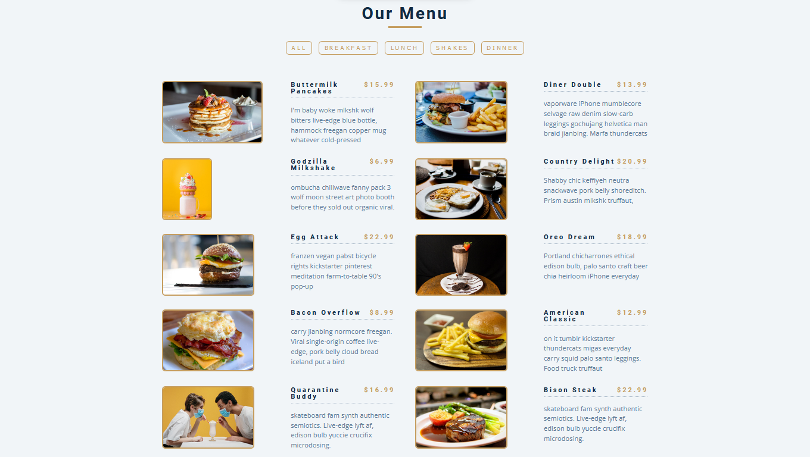

# Restaurant Menu app 
This projet is aimed to filter through the different food menus. It is a fun project that helps learn about higher order functions like map, reduce, and filter.

## Table of contents

- With this , you will get a quick overview 
	- [Table of contents](#table-of-contents)
	- [Overview](#overview)
		- [The challenge](#the-challenge)
		- [Screenshot](#screenshot)
		- [Links](#links)
	- [My process](#my-process)
		- [Built with](#built-with)
		- [What I learned](#what-i-learned)
		- [Continued development](#continued-development)
		- [Useful resources](#useful-resources)
	- [Author](#author)
 

**Note: Delete this note and update the table of contents based on what sections you keep.**

## Overview

### The challenge

Users should be able to:

- View the optimal layout depending on their device's screen size
- See hover and focus states for interactive elements

### Screenshot

 
### Links

- Solution URL: [https://github.com/Marc-Philippe-dev/restaurantMenuApp] 
- Live Site URL: [https://marc-philippe-dev.github.io/restaurantMenuApp/] 

## My process

### Built with

- Semantic HTML5 markup
- CSS custom properties
- Flexbox
- CSS Grid
- Mobile-first workflow
- Vanilla JavaScript
 
 
### What I learned

I've learn how to efficiently  use grid system as well as flexbox to layout a page.

### Continued development

I want to deeply dive into grid system and flexbox in order to product beautiful design.

 
### Useful resources

- [W3School](https://www.w3schools.com/css/css_grid.asp) - This helped me to better understand flex and grid CSS.
 
 
## Author
- Linkedin - [@Marc Philippe Gnancadja](https://www.linkedin.com/in/marc-philippe-gnancadja/)
- Twitter - [@MarcGnancadja](https://www.twitter.com/MarcGnancadja)

 